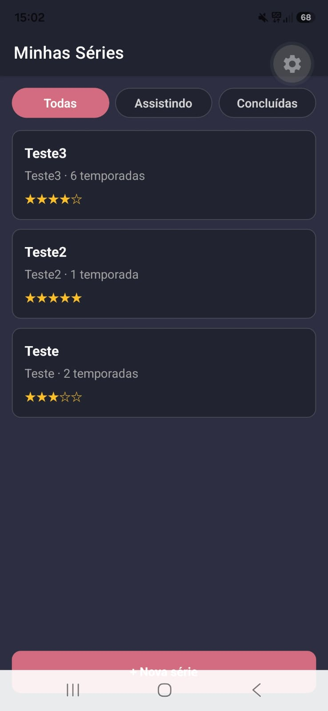
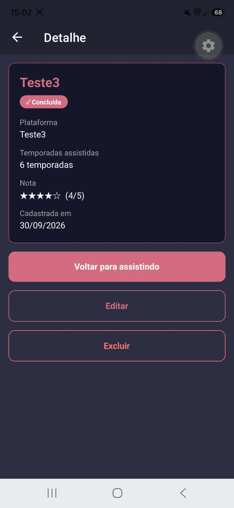
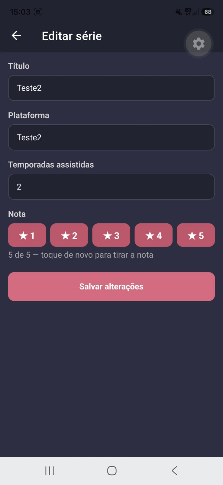
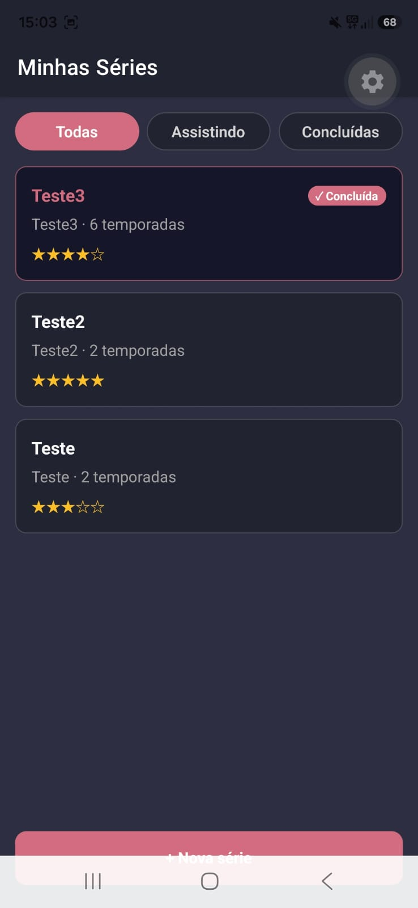
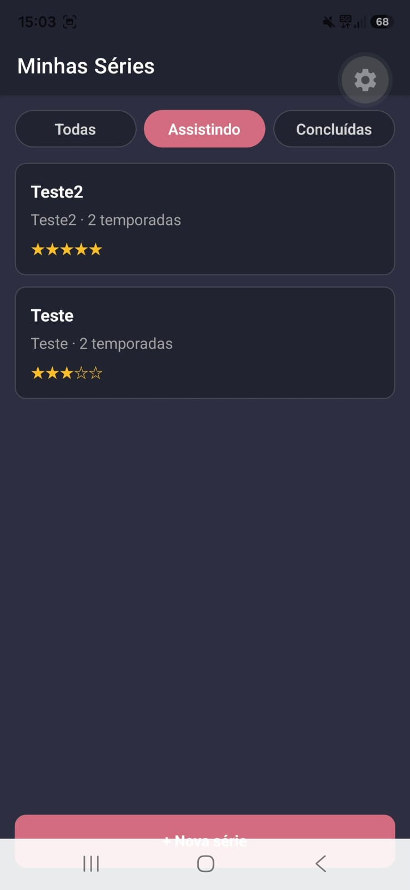
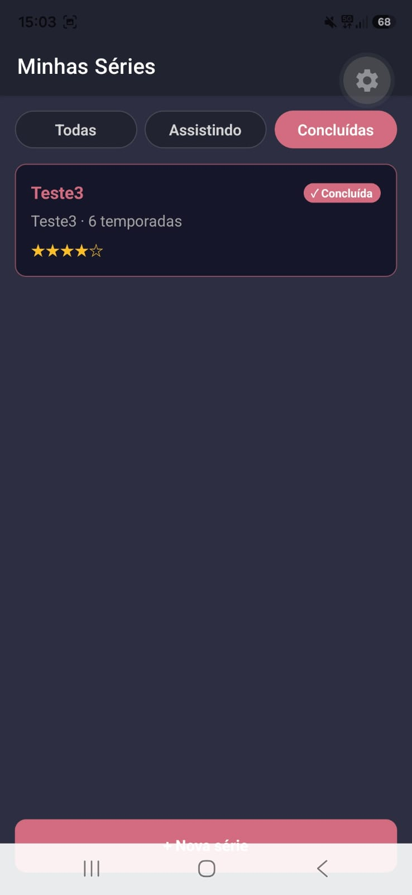

# Minhas Séries

App mobile desenvolvido para atividade da materia de Programação para Dispositivos Móveis para registrar as séries que assisti ou estou assistindo. Ele permite cadastrar, editar, marcar como concluída, excluir e filtrar entre **todas**, **assistindo** e **concluídas**.

Feito com Expo (SDK 57), Expo Router, NativeWind 4, expo-sqlite, React Native 0.86.3 e TypeScript, separando tela, repositório e conexão com o banco.

## Como rodar

```bash
npm install
npx expo start
```

Depois é só escanear o QR code com o app **Expo Go**.

Para checar os tipos:

```bash
npx tsc --noEmit
```

## Estrutura

```
app/
  _layout.tsx        Stack com as rotas index, form e detalhe
  index.tsx          Lista com filtros
  form.tsx           Cadastro (/form) e edição (/form?id=3) na mesma tela
  detalhe.tsx        Detalhe com concluir, editar e excluir
src/
  types/serie.ts             Serie, CreateSerieInput, UpdateSerieInput, SerieFilter
  database/database.ts       Conexão singleton + migrations
  database/serieRepository.ts  As 6 funções de acesso ao banco
```

## Teste de persistência

**1. Cadastrei 3 séries** (Teste, Teste2 e Teste3):



**2. Concluí uma** (Teste3). No detalhe ela aparece como concluída, e na lista o card fica diferente:

 

**3. Editei outra** (Teste2, de 1 para 2 temporadas):

 

**4. Fechei o app completamente e abri de novo.** Tudo continuou lá, e os filtros funcionando:

 

## Diário do copiloto

### Registro 1 — Etapa 1
**O que eu pedi:** explicar o erro `Cannot find module 'babel-preset-expo'` que apareceu ao rodar o app depois de configurar o NativeWind.
**O que a IA sugeriu (resumo):** no Expo SDK 57 o `babel-preset-expo` não fica mais no topo do `node_modules`, mas o `babel.config.js` do NativeWind precisa dele lá. Sugeriu instalar com `npx expo install babel-preset-expo`.
**O que eu fiz:** aceitei. Usei `npx expo install` (e não `npm install`) para vir a versão compatível com o SDK.

### Registro 2 — Etapa 1
**O que eu pedi:** por que o `npx tsc --noEmit` dava erro TS2882 no `import '../global.css'` do `_layout.tsx`.
**O que a IA sugeriu (resumo):** o TypeScript 6 passou a validar imports de efeito colateral, e o NativeWind 4 não declara arquivos `.css`. Sugeriu adicionar `declare module '*.css';` no `nativewind-env.d.ts`.
**O que eu fiz:** aceitei. O `tsc` ficou limpo e o import continua sendo a primeira linha do layout.


### Registro 3 — Rodando no celular
**O que eu pedi:** explicar o "failed to download remote update" no Expo Go, e depois o erro do PowerShell ao rodar `npx` ("a execução de scripts foi desabilitada").
**O que a IA sugeriu (resumo):** meu computador está numa rede corporativa que não deixa o celular chegar no Metro, então era preciso usar `npx expo start --tunnel`. Para o PowerShell, usar `npx.cmd` ou liberar scripts só para o meu usuário com `Set-ExecutionPolicy -Scope CurrentUser RemoteSigned`.
**O que eu fiz:** adaptei. Liberei os scripts só para o meu usuário e passei a rodar com `--tunnel`.

### Registro 4 — Rodando no celular
**O que eu pedi:** como resolver o `CommandError: Install @expo/ngrok@^4.1.0 and try again`.
**O que a IA sugeriu (resumo):** instalar dentro do projeto com `npm install --save-dev @expo/ngrok@^4.1.0`.
**O que eu fiz:** corrigi. O comando sugerido falhou com `ERESOLVE`, porque uma dependência opcional do Expo (`react-dom`) pede outra versão do React. Rodei de novo com `--legacy-peer-deps`, igual fizemos com o NativeWind. Aqui o `npm install` está certo, e não o `npx expo install`, porque o ngrok é só ferramenta de desenvolvimento e não roda no app.

### Registro 5 — Etapa 4
**O que eu pedi:** como fazer o filtro de concluídas no SQL e como alternar `concluida` entre 0 e 1.
**O que a IA sugeriu (resumo):** para `'todas'`, query sem `WHERE`; para os outros filtros, `WHERE concluida = ?` passando 0 ou 1. Para o toggle, `UPDATE series SET concluida = 1 - concluida WHERE id = ?`.
**O que eu fiz:** aceitei. Conferi que nenhuma query usa template string (`${}`); todo valor entra com `?`. O `1 - concluida` inverte o valor sem precisar ler a série antes.

### Registro 6 — Parte 3 (Etapas 5 e 7)
**O que eu pedi:** por que a série nova não apareceria na lista usando `useEffect(() => { carregar(); }, [])`, e como o `useFocusEffect` funciona.
**O que a IA sugeriu (resumo):** ao voltar do formulário, a lista não é montada de novo; ela só estava embaixo na pilha, então o `useEffect` com `[]` não roda outra vez. O `useFocusEffect` roda toda vez que a tela ganha foco. Ele pede um `useCallback` porque, sem ele, a função seria recriada a cada render e o efeito rodaria de novo sem parar.
**O que eu fiz:** aceitei e usei na lista, com `[filtro]` nas dependências para recarregar também ao trocar o filtro. Usei também no detalhe, porque depois de editar e voltar ele precisa mostrar os dados novos.
